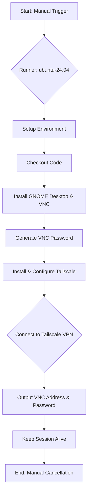
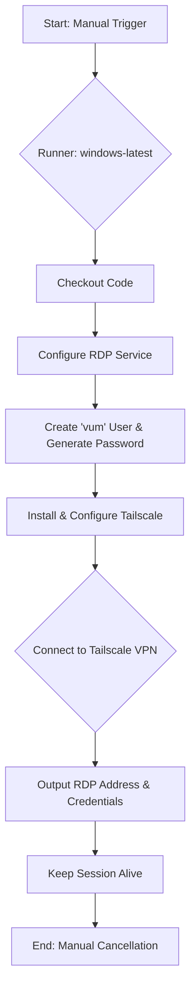

# GitHub Workflows Overview

This document provides an explanation of the GitHub Actions workflows defined in this repository. These workflows are designed to create temporary, secure remote access to GitHub-hosted runners for interactive sessions.

## Core Concepts

Both workflows follow a similar pattern:

1.  **Manual Trigger:** They are triggered manually via `workflow_dispatch`, not by code pushes or pull requests.
2.  **Secure Tunneling:** They use [Tailscale](https://tailscale.com/) to create a secure peer-to-peer VPN connection to the runner. This avoids exposing the remote access port to the public internet.
3.  **Dynamic Credentials:** Access credentials (passwords) are generated dynamically for each run.
4.  **Long-Running Sessions:** They are configured with a long timeout and a final "keep-alive" step to allow for extended interactive sessions. The workflow must be manually canceled to terminate the session.

---

## Workflows

### 1. Ubuntu VNC Server (`ubuntu-vnc.yml`)

This workflow provisions an Ubuntu runner with a full GNOME desktop environment and makes it accessible via a VNC client.

**Mermaid Diagram:**

**Key Steps:**

- **Platform:** `ubuntu-24.04`
- **Remote Access:** VNC (Virtual Network Computing)
- **Process:**
    1.  The workflow starts on a fresh Ubuntu runner.
    2.  It uses a series of scripts to carefully install `gnome-shell`, `x11vnc`, and other desktop components. `systemctl` is temporarily disabled to prevent services from auto-starting incorrectly during the image build process.
    3.  A random, secure 16-character password for the VNC session is generated.
    4.  Tailscale is installed and authenticated using the `TAILSCALE_AUTH_KEY` repository secret.
    5.  The VNC server is started.
    6.  The workflow prints the Tailscale IP address and the generated VNC password to the workflow logs.
    7.  A final loop keeps the runner active until it is manually stopped.

### 2. Windows RDP Server (`windows-rdp.yml`)

This workflow provisions a Windows runner and makes it accessible via a Remote Desktop Protocol (RDP) client.

**Mermaid Diagram:**

**Key Steps:**

- **Platform:** `windows-latest`
- **Remote Access:** RDP (Remote Desktop Protocol)
- **Process:**
    1.  The workflow starts on a fresh Windows runner.
    2.  It runs a series of PowerShell scripts to:
        - Enable and configure the RDP service.
        - Create a local user named `vum` and generate a secure, random password.
    3.  Tailscale is installed and authenticated using the `TAILSCALE_AUTH_KEY` repository secret.
    4.  The workflow prints the runner's Tailscale IP address and the `vum` user's password to the workflow logs.
    5.  A final loop keeps the runner active until it is manually stopped.

## How to Use

1.  Go to the "Actions" tab of the repository.
2.  Select either the "Ubuntu VNC Server" or "Windows RDP Server" workflow from the list.
3.  Click the "Run workflow" button.
4.  Once the job starts, expand the logs for the `secure-rdp` or `ubuntu-vnc` job.
5.  Wait for the "Connect to Tailscale" and credential generation steps to complete.
6.  Look for the output containing the IP address and password.
7.  Use your local Tailscale client and a VNC/RDP client to connect.
8.  **Important:** When you are finished, you **must** manually cancel the workflow run from the Actions tab to shut down the runner.
